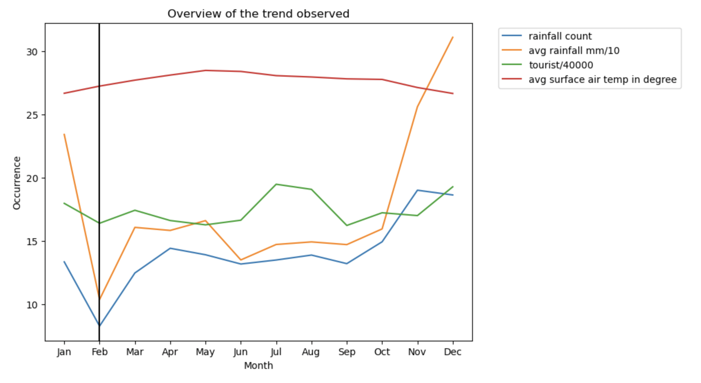

#  Project 1: Exploring climate data of Singapore

### Overview

### Problem Statement
i am task to advice and tourist to come to singapore to improve our tourist count as during covid year Singapore Tourism took a big hit. As weather in singapore are largely hot or rainy, tourist might not be familiar with local weather condition therefore might caught in bad weather condition which will disrupt their outdoor activities plan during the stay in Singapore. 
this project aims to analyse trends in Singapore weather and tourist inbound to identify when will be the best time for the tourist to visit singapore to enjoy outdoor activities. 
this analysis will help tourist to better plan travel period and itinerary better, bringing them a more pleasant experience during the stay in Singapore

---

### Datasets
* [`M550001.csv`](./data/M550001.csv): data from 1978 to 2022OCT. Compiled from SG Arrival cards completed by all visitors arriving in Singapore at point of entery. Excludes arrivals of Malaysian by land. 
Gererated by: Singstat Table Builder
Date generated: 10/12/2022
https://www.singstat.gov.sg/find-data/search-by-theme/industry/tourism/latest-data. 

* [`surface-air-temperature-monthly-mean.csv`](./data/urface-air-temperature-monthly-mean.csv): montly mean temp in degree) from 1982 to 2022
(https://data.gov.sg/dataset/surface-air-temperature-mean-daily-minimum)

|Feature|Type|Dataset|Description|
|---|---|---|---|
|total_rainfall|float|rainfall-monthly-total|Total rainfall in mm| 
|no_of_rainy_days|int64|rainfall-monthly-total-of-rain-days|Total number of rainfall|
|year|int64|rainfall-monthly-total|year| 
|month_of_year|int64|rainfall-monthly-total|month| 
|date|datetime64[ns]|rainfall-monthly-total|date| 
|total_visitor_inbound|int64|M550001|inbound visitor| 
|mean_temp|float64|surface-air-temperature-monthly-mean|mean tempeture in month| 

#### Provided Data

There are 2 datasets included in the [`data`](./data/) folder for this project. These correponds to rainfall information. 

* [`rainfall-monthly-number-of-rain-days.csv`](./data/rainfall-monthly-number-of-rain-days.csv): Monthly number of rain days from 1982 to 2022. A day is considered to have “rained” if the total rainfall for that day is 0.2mm or more.
* [`rainfall-monthly-total.csv`](./data/rainfall-monthly-total.csv): Monthly total rain recorded in mm(millimeters) from 1982 to 2022

Other relevant weather datasets from [data.gov.sg](data.gov.sg) that you can download and use are as follows:

* [Relative Humidity](https://data.gov.sg/dataset/relative-humidity-monthly-mean)
* [Monthly Maximum Daily Rainfall](https://data.gov.sg/dataset/rainfall-monthly-maximum-daily-total)
* [Hourly wet bulb temperature](https://data.gov.sg/dataset/wet-bulb-temperature-hourly)
* [Monthly mean sunshine hours](https://data.gov.sg/dataset/sunshine-duration-monthly-mean-daily-duration)
* [Surface Air Temperature](https://data.gov.sg/dataset/surface-air-temperature-mean-daily-minimum)

### Conclusions and Recommendations
Tourist who like to come to Singapore for outdoor activites will like to have a good weather and also to be less cworded with people to enjoy the best of all attraction in singapore

Trip to outdoor venues such as Universal Stuido, singapore Zoological Garden best to be plan on Feb as the both amount of rainfall and total rainfall is the lowest. also the temp during Feb is considerable cooling compare to other month of the year. additional to that Feb have a lowest number of inbound tourist, it might be due to not school holiday period and chinese new year is around the corner, therefore tourist inbound is lower in Feb

For month with higher amount of rainy day, outdoor venues need to plan for more indoor event to attract tourist to come to singpore.Travke agency can do package sale of discount outdoor attractive ticket to attract tourist to singapore

