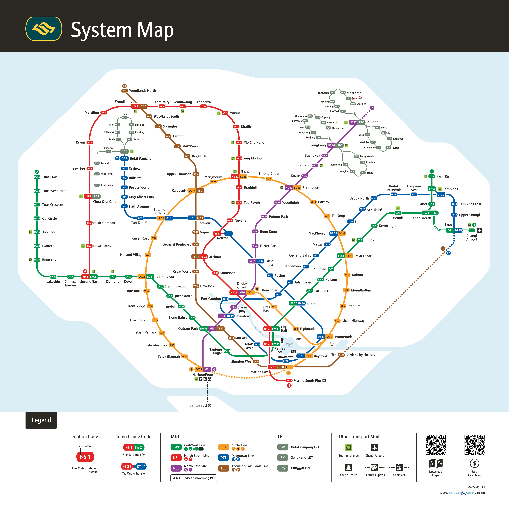
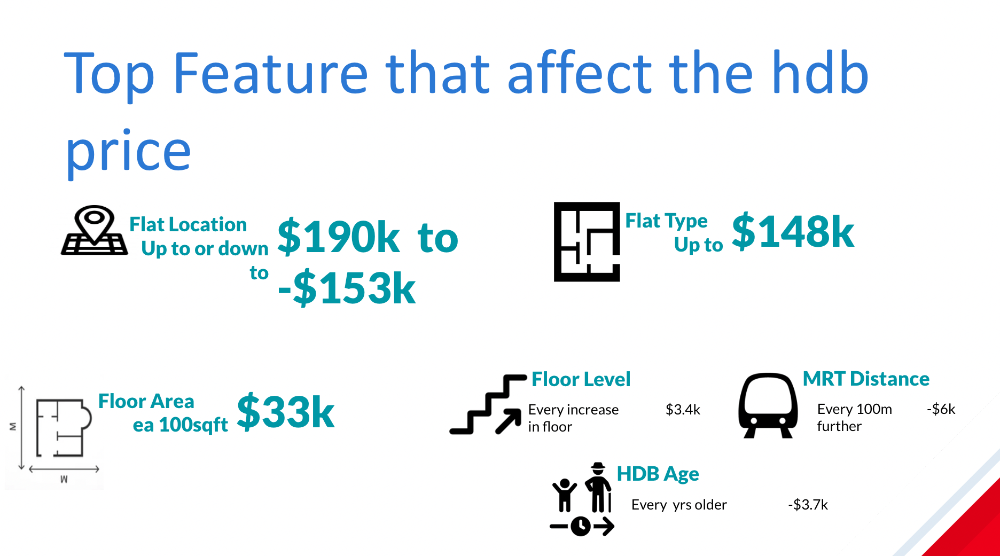

#   Project 2 - Singapore Housing Data and Kaggle Challenge

**Primary Learning Objectives:**
1. Creating and iteratively refining a regression model
2. Using [Kaggle](https://www.kaggle.com/) to practice the modeling process
3. Providing business insights through reporting and presentation.

# Problem Statement

- To understand which factor(s) play a larger part in affecting the price of resale HDBs in Singapore. 
- This project mainly investigates how a HDB unit's distance to shopping mall, hawker centre and/or MRT will impact the value of a HDB unit

- This will allow both buyers and sellers alike to understand the estimated market value of a HDB unit in question with respect to the proximity of a unit to the aforementioned factors

- This project will utilize the Singapore HDB datasets transaction from (2012 - 2021), along with the regression model to determine the upcoming HDB resale prices. 

- The predicted resale prices will be summbitted to [Kaggle](https://www.kaggle.com/competitions/dsi-sg-project-2-regression-challenge-hdb-price/overview) for scoring.

# Data set
* [`train.csv`](./datasets/train.csv): training data provided which contain all features and HDB resale prices
* [`test.csv`](./datasets/test.csv): test dataset will all features only. use to predict the HDB resale prices
* [`sample_sub_reg.csv`](./datasets/sample_sub_reg.csv): sumbition template for kaggle
* [`hdb_final_data.csv`](./datasets/hdb_final_data.csv): preprocesed data set for training
* [`pred.csv`](./datasets/pred.csv): preprocesed data set for model prediction
* [`lr.csv`](./datasets/lr.csv): data set for sumbition for kaggle

### EDA

- Transforming predicted value to normal distribution

- Above finding shows a linear relationship between the age of a HDB flat and the resale price. That is, the younger the HDB flat, the higher the resale price. This could be a result of the below HDB regulation. Image reference and source link is as per below.
[Link](https://www.hdb.gov.sg/residential/buying-a-flat/financing-a-flat-purchase/housing-loan-options/housing-loan-from-hdb)

- From this box plot, we can infer the Central areas like Queentown and Bukit Timah have a higher resale price compared to the other neighbourhoods. 
- This could be because of Central neighbourhood's close proximity to highly connected MRT interchanges like 'Outram Park' and 'Dhoby Ghaut'. 

From the above box plot, we can see there is a linear relationship between the storey of the unit and the resale price. That is, the greater the elevation of a HDB unit, the higher the resale price. This is likely due to a preference for higher floors by prospective HDB owners as the higher elevation provides better sunlight and wind ventilation. In addition, higher storey units are less likely to be prone to pests infestation given the greater distance from the ground floor rubbish chute. 
[Link](https://www.propertyguru.com.sg/property-guides/high-floor-vs-low-floor-unit-which-is-better-45449)

### Conclusions and Recommendation:

in this project, linear regression  were used to looked at the drivers of HDB resale prices. Linear regression is powerful because it allows us to interpret the results of the model by looking at its coefficients for each feature. However, it assumes a linear relationship between the features and the outcome, which isn't always the case in real life. 

Looking at the output of the models, from both linear and lasso regression model showed that town location, floor area, flat model, lease commencement date and distance from mrt are the top 5 drivers of HDB prices.

first timer owner can also take a look in the flat near the north area exmaple: woodland, sembawang. as the hdb resale price is lower in that area

### Thing to be improve in future:
1. We may want to separate the datasets by flat type. This would allow analyst to specifically focus on the targeted flat type instead of inputting the entire dataset into the model, which would provide a lower accuracy when analyzing a specific flat type. 

2. We can also create models incorporating all the features while excluding features that are similar to each other. Subsequently, analyst may choose to remove each individual feature at a time to verify the model's accuracy and choose to improve it further. 

3. In addition, the resale prices within the dataset might not have the same feature value as it is now. This is because certain ammenities (e.g. Schools, Shopping malls, Hawker Center) and transportation features (e.g. bus stops with express busses, newer MRT routes) might not have been built or launched when the flat was sold. To elaborate, HDBs within close proximity to the Downtown line today (launched in 2017) would have been relatively further from the main North-South line in the 1960s thus the resale prices would have been considerably cheaper then, causing the dataset to be inaccurate by today's standards. 

4. Lastly, the dataset have yet to take into account the Housing Inflation Index to provide a more accurate prediction model. Analyst may choose to incorporate this datapoint into the model to improve the accuracy of the model. 